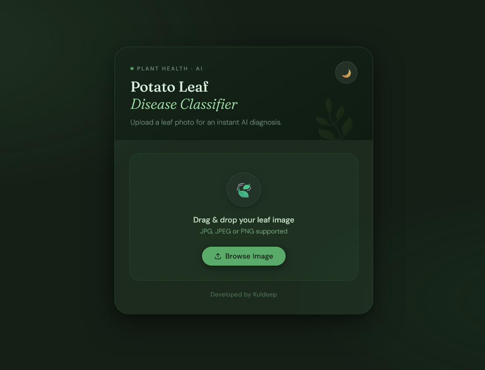
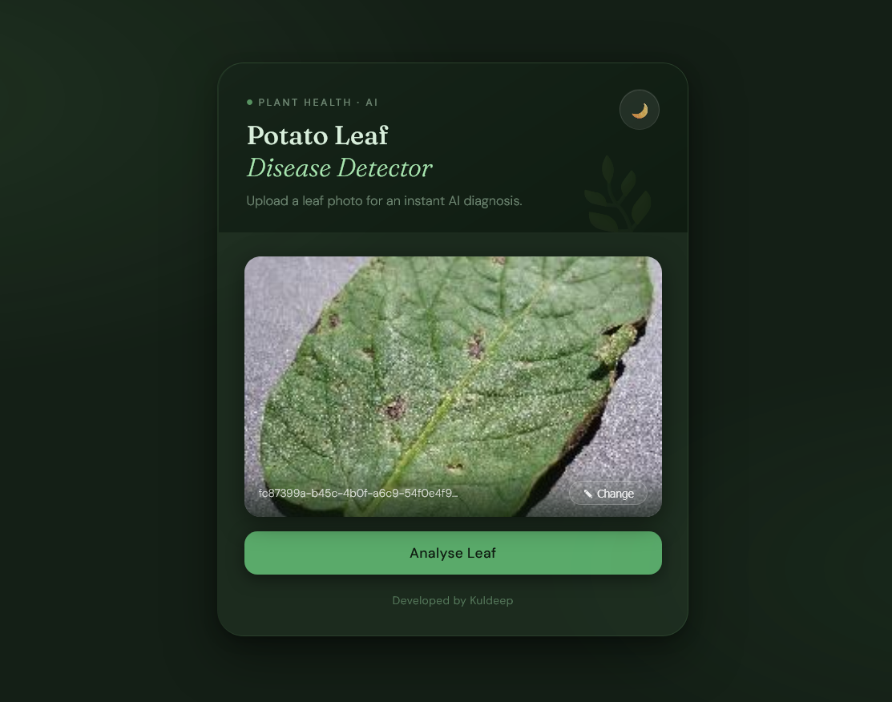
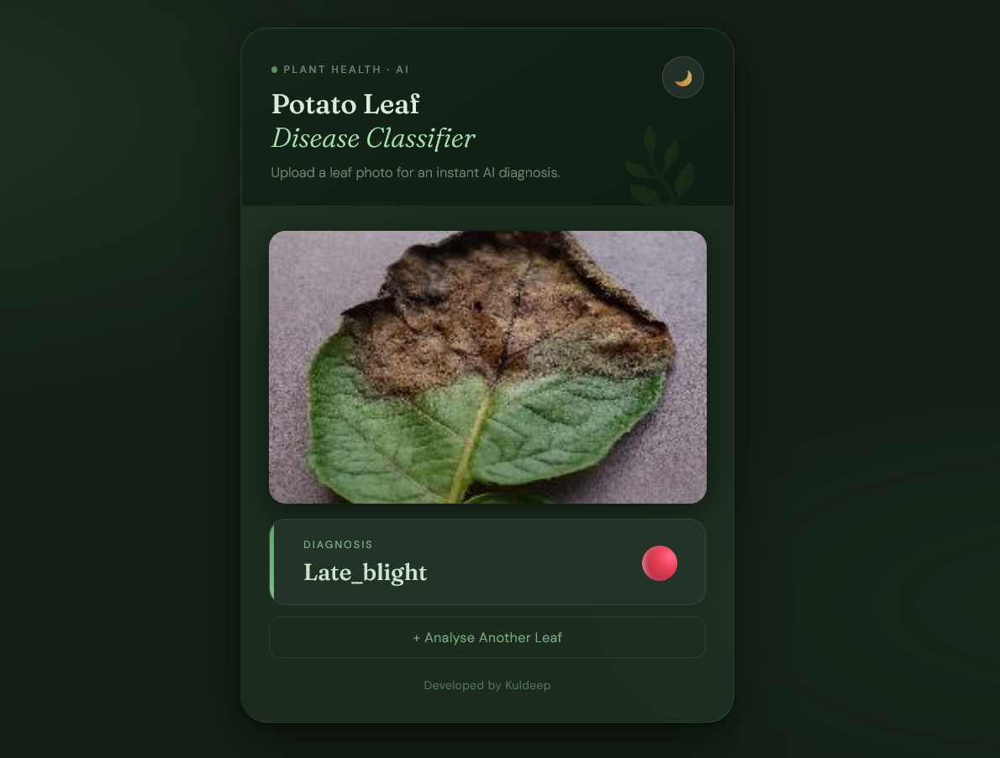
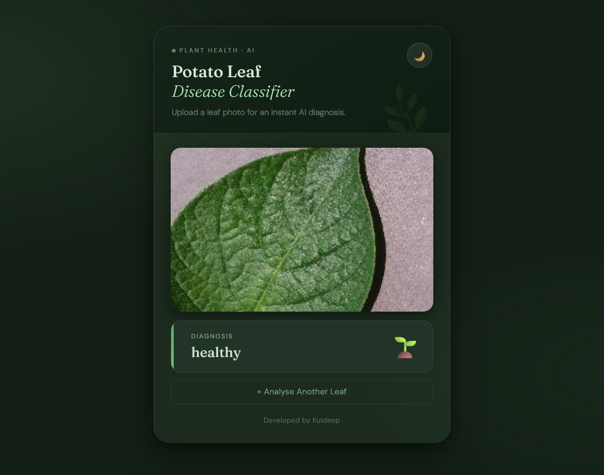

# 🥔 Potato Leaf Disease Classifier Model

> An AI-powered web application that detects potato leaf diseases using deep learning (EfficientNetB7).

---

## 🤖 What is this Project?

This project is a smart AI system that helps detect diseases in potato leaves automatically using image classification.

Instead of manual inspection, users can simply upload a leaf image, and the model will predict whether the plant is healthy or diseased.

---

## ✨ Features

- **Deep Learning Model** — Built using EfficientNetB7 (state-of-the-art CNN)  
- **3-Class Classification**:
  - Early Blight  
  - Late Blight  
  - Healthy Leaf  
- **Simple Web Interface** — Upload and get instant results  
- **Image Preview** — Displays uploaded image with prediction  
- **Fast & Accurate Predictions**  

---

## 🧠 How It Works

1. User uploads a potato leaf image  
2. Image is preprocessed (resize, normalize)  
3. Passed to trained EfficientNetB7 model  
4. Model predicts the disease category  
5. Result is displayed with the uploaded image  

---

## 🖼️ ![Project Interface]

### 🔹 Upload Interface


---

## 🌿 Prediction With Disease Categories

### 1️⃣ Early Blight


### 2️⃣ Late Blight


### 3️⃣ Healthy Leaf


---

## 🛠️ Tech Stack

| Layer | Technology |
|------|-----------|
| Backend | Python, Flask |
| Model | EfficientNetB7 |
| AI Framework | TensorFlow / Keras |
| Frontend | HTML, CSS |
| Image Handling | OpenCV / PIL |

---

## 📁 Project Structure

    project/
    ├── static/
    │   └── uploads/        # Uploaded images
    ├── templates/          # HTML files
    ├── model/              # Trained model (model.h5)
    ├── app.py              # Flask app
    └── README.md

---

## 🚀 Getting Started

Follow these steps to run the project locally:

---
### 1️⃣ Clone the Repository

```bash
git clone https://github.com/yourusername/potato-disease-classifier.git
cd potato-disease-classifier 
```

### 2️⃣ Install Anaconda (if not installed)

- Download Anaconda from:  
  https://www.anaconda.com/download  

- Install it with default settings  

---

### 3️⃣ Open Anaconda Prompt

- Search **"Anaconda Prompt"** in Windows  
- Right-click → **Run as Administrator**

---

### 4️⃣ Create & Activate Virtual Environment
```bash
conda create -n env_for_webapp python=3.10 -y
conda activate env_for_webapp
```

### 5️⃣ Install Dependencies
```bash
pip install flask tensorflow keras pillow numpy
```

### 6️⃣ Download Model Weights
To run this project, you need the trained model weights.

🔗 Download from Google Drive::  
https://drive.google.com/file/d/1R47eGBS7Tj1asoNvlCxmmT1ZIlbLgHiu/view?usp=sharing

- Place the file inside:
  -> model/model.h5

### 7️⃣ Run the Application

1. Open **Anaconda Prompt** (Run as Administrator)

2. Activate your environment:
```bash
conda activate env_for_webapp
```
3. Navigate to the project directory:
```bash
cd potato-disease-classifier
```
4. Run the application:
```bash
python app.py
```

---

###  8️⃣ Open in Browser
http://127.0.0.1:5000

